# 🧠 Awesome Knowledge Management Platform 📚

  
  
  
  
  

> **Ultimate Curated Ecosystem of Knowledge Management Platforms, Internal Team Wikis, Personal Knowledge Management (PKM) Tools, and Collaborative Workspace Software.**

---

## 📌 Table of Contents
- [🔍 Overview](#-overview)
- [🏢 SaaS & Hosted Knowledge Management Platforms](#-saas--hosted-knowledge-management-platforms)
- [🌐 Open-Source Knowledge Base & Wiki Projects](#-open-source-knowledge-base--wiki-projects)
- [🤝 How to Contribute](#-how-to-contribute)
- [💖 Support & Community](#-support--community)
- [📈 Star History](#-star-history)
- [⚠️ Disclaimer](#-disclaimer)

---

## 🔍 Overview
This repository tracks top-tier **SaaS Knowledge Management Platforms** and **Open-Source GitHub Projects** designed for modern engineering teams, enterprise knowledge workers, technical writers, and product managers. Whether you are searching for an enterprise wiki, developer documentation portal, AI-powered knowledge assistant, or self-hosted privacy-first note-taking system, this list covers the best solutions available.

---

## 🏢 SaaS & Hosted Knowledge Management Platforms

### 📊 Market Landscape & Sector Analysis
> **Market Size & Structure:** The global Knowledge Management Software market size is estimated at **$28.5 Billion (2026)** and is projected to grow at a CAGR of ~16.5%. The market is **moderately fragmented**: enterprise suite monoliths (e.g., Atlassian Confluence, Microsoft 365) command large corporate shares, while fast-growing category disruptors (Notion, Guru, Helpjuice) capture specialized niches with deep AI ingestion and modular collaborative workflows.

### 💰 SaaS Platform Comparison Matrix

| Platform 🚀 | Description 📝 | Market Size / Valuation 📈 | Starting Price (Paid Tier) 💵 | Free Tier / Free Trial Limits 🎁 |
| :--- | :--- | :--- | :--- | :--- |
| **[Notion](https://www.notion.so)** | All-in-one collaborative workspace combining docs, wikis, project databases, and AI workflows. | **$10.0 Billion** (Valuation) | **$8.00** / user / month (Plus Plan) | **Free Forever** (Unlimited blocks for individuals, 1,000 block limit for team trials, 5MB file upload limit) |
| **[Confluence](https://www.atlassian.com/software/confluence)** | Atlassian's flagship enterprise team wiki & documentation hub deeply integrated with Jira. | **$45.0 Billion** (Atlassian Market Cap) | **$6.05** / user / month (Standard Plan) | **Free Forever** (Up to 10 users, 2 GB storage limit, structured page hierarchy) |
| **[Stack Overflow for Teams](https://stackoverflow.com/teams/)** | Private, secure technical Q&A knowledge platform with AI ingestion & MCP server integrations. | **$1.8 Billion** (Acquisition Valuation) | **$6.50** / user / month (Basic Plan) | **Free Forever** (Up to 50 users, basic Q&A features, core integrations) |
| **[Guru](https://www.getguru.com)** | AI-driven enterprise knowledge discovery platform surfacing verified answers across Slack & apps. | **$500.0 Million** (Estimated Valuation) | **$15.00** / user / month (All-in-One Plan) | **30-Day Free Trial** (Full access to AI enterprise search & verification workflows for up to 50 users) |
| **[Bloomfire](https://bloomfire.com)** | Enterprise knowledge engagement platform with AI-powered search, Q&A, and video transcription. | **$150.0 Million** (Estimated Valuation) | **$25.00** / user / month (Tesseract Plan) | **14-Day Free Trial** (Full access to knowledge verification, AI deep search, & analytics) |
| **[Document360](https://document360.com)** | Specialized knowledge base software for internal teams and public customer help centers. | **$100.0 Million** (Estimated Valuation) | **$149.00** / project / month (Standard Plan) | **14-Day Free Trial** (Full access to 1 project version, public help center, & analytics) |
| **[Helpjuice](https://helpjuice.com)** | High-performing knowledge base platform with AI search, rich authoring, and custom themes. | **$80.0 Million** (Estimated Valuation) | **$120.00** / month (Starter Plan up to 4 users) | **14-Day Free Trial** (Full features including free custom design customization service) |
| **[Slab](https://slab.com)** | Modern, sleek internal documentation platform with unified cross-app search & Slack integration. | **$50.0 Million** (Estimated Valuation) | **$6.67** / user / month (Startup Plan) | **Free Forever** (Up to 10 users, 90-day version history limit, 10MB file limit) |
| **[Nuclino](https://www.nuclino.com)** | Lightweight real-time collaborative wiki with document editor, kanban boards, & visual graph view. | **$30.0 Million** (Estimated Valuation) | **$5.00** / user / month (Standard Plan) | **Free Forever** (Up to 50 items, 3 GB total storage space) |
| **[Tettra](https://tettra.com)** | AI-assisted internal knowledge base capturing tribal knowledge directly inside Slack & MS Teams. | **$20.0 Million** (Estimated Valuation) | **$4.00** / user / month (Basic Plan) | **30-Day Free Trial** (Up to 10 users, AI answer bot integration, Slack capture) |

---

## 🌐 Open-Source Knowledge Base & Wiki Projects

Self-hosted, transparent, and community-driven open-source projects ranked by GitHub stargazers count:

1. **[AppFlowy](https://github.com/AppFlowy-IO/AppFlowy)**  🌟 `76,851 stars`
   * Open-source Notion alternative built with Flutter and Rust. Features local-first architecture, offline storage, kanban boards, grid databases, and AI writing assistance. *License: AGPL-3.0*

2. **[AFFiNE](https://github.com/toeverything/AFFiNE)**  🌟 `72,781 stars`
   * Privacy-focused, local-first workspace combining block-based text documents and infinite canvas design. Positioned as a Notion + Miro hybrid alternative. *License: MIT*

3. **[Docusaurus](https://github.com/facebook/docusaurus)**  🌟 `66,290 stars`
   * Meta's flagship static site generator optimized for technical documentation, developer portals, and blogs. Built with React. *License: MIT*

4. **[Joplin](https://github.com/laurent22/joplin)**  🌟 `56,442 stars`
   * Open-source, end-to-end encrypted note-taking and task application. Supports Markdown, web clipper, and multi-platform sync via Nextcloud/S3. *License: AGPL-3.0*

5. **[Logseq](https://github.com/logseq/logseq)**  🌟 `44,981 stars`
   * Privacy-first, local-first knowledge base and outliner utilizing bidirectional linking, graph view, and plain-text Markdown/Org-mode files. *License: AGPL-3.0*

6. **[Outline](https://github.com/outline/outline)**  🌟 `40,628 stars`
   * Blazing fast, collaborative team wiki with a beautiful Notion-like editor, nested document structures, Slack integration, and OIDC/SAML authentication. *License: BSL 1.1*

7. **[Trilium Notes](https://github.com/zadam/trilium)**  🌟 `37,907 stars`
   * Hierarchical personal knowledge base and note-taking tool with deep custom scripting, mind mapping, and backlink relation graphs. *License: AGPL-3.0*

8. **[Wiki.js](https://github.com/requarks/wiki)**  🌟 `28,945 stars`
   * Powerful Node.js wiki engine supporting Markdown, WYSIWYG, multi-language translation, Git synchronization, and multi-database support. *License: AGPL-3.0*

9. **[Discourse](https://github.com/discourse/discourse)**  🌟 `22,452 stars`
   * Modern community discussion forum platform ideal for public team Q&A, knowledge sharing, and enterprise community support. *License: GPL-2.0*

10. **[Docmost](https://github.com/docmost/docmost)**  🌟 `21,735 stars`
    * Open-source Confluence and Notion alternative for collaborative team wikis. Features space permissions, diagrams (Excalidraw/Mermaid), and real-time editing. *License: AGPL-3.0*

11. **[SiYuan](https://github.com/siyuan-note/siyuan)**  🌟 `19,050 stars`
    * Privacy-first personal knowledge management system featuring block-level reference graph, Markdown WYSIWYG, and offline synchronization. *License: AGPL-3.0*

12. **[La Suite Docs (suitenumerique)](https://github.com/suitenumerique/docs)**  🌟 `16,838 stars`
    * Collaborative document, wiki, and note-taking platform created by the French government as an open-source Google Docs alternative (Django + React). *License: MIT*

13. **[BookStack](https://github.com/BookStackApp/BookStack)**  🌟 `16,000 stars`
    * Simple, self-hosted documentation system organized intuitively into Books, Chapters, and Pages with built-in role permissions. *License: MIT*

14. **[HedgeDoc](https://github.com/hedgedoc/hedgedoc)**  🌟 `15,679 stars`
    * Real-time collaborative Markdown editor for technical notes, presentations, and team brainstorming. Formerly CodiMD. *License: AGPL-3.0*

15. **[Notesnook](https://github.com/streetwriters/notesnook)**  🌟 `14,614 stars`
    * Zero-knowledge end-to-end encrypted note-taking application focused on complete user privacy and cross-platform sync. *License: GPL-3.0*

16. **[TiddlyWiki5](https://github.com/TiddlyWiki/TiddlyWiki5)**  🌟 `14,325 stars`
    * Unique non-linear personal web notebook and single-file wiki system with 15+ years of active development. *License: BSD-3-Clause*

17. **[MkDocs](https://github.com/mkdocs/mkdocs)**  🌟 `8,655 stars`
    * Fast, simple static site generator geared towards project documentation. Configured with YAML and written in Python. *License: BSD-2-Clause*

18. **[Apache Answer](https://github.com/apache/answer)**  🌟 `7,437 stars`
    * Open-source Q&A community platform software for teams and developer knowledge sharing (Stack Overflow clone). *License: Apache-2.0*

19. **[DokuWiki](https://github.com/dokuwiki/dokuwiki)**  🌟 `4,720 stars`
    * Standards-compliant, versatile open-source wiki engine that operates without a database using plain text files. *License: GPL-2.0*

20. **[Gollum](https://github.com/gollum/gollum)**  🌟 `1,311 stars`
    * Lightweight Git-powered wiki engine powering original GitHub wikis with Markdown and AsciiDoc rendering. *License: MIT*

---

## 🛠️ Recommended Architecture Blueprint
When building a custom developer knowledge ecosystem:
* Use **[Outline](https://github.com/outline/outline)** or **[Docmost](https://github.com/docmost/docmost)** for internal team wikis & SOPs.
* Deploy **[Docusaurus](https://github.com/facebook/docusaurus)** for public API and developer reference portals.
* Integrate **[AppFlowy](https://github.com/AppFlowy-IO/AppFlowy)** or **[AFFiNE](https://github.com/toeverything/AFFiNE)** for collaborative infinite canvases & visual project hub pages.
* Leverage **PostgreSQL** + **Redis** + **S3** for resilient persistence, and **Ollama** for self-hosted LLM search assistance.

---

## 🤝 How to Contribute
Contributions are warmly welcomed! Help keep this knowledge management catalog accurate and comprehensive:
1. 🍴 **Fork** the repository.
2. 📝 **Add/Update** entries in `README.md` maintaining table/list formatting.
3. 🔍 Ensure descriptions remain objective and factual with direct site links.
4. 🚀 **Submit a Pull Request** with a brief summary of changes.

---

## 💖 Support & Community

Thank you for exploring and using the **Awesome Knowledge Management Platform** repository! If this curated list helps you discover tools or build your team's knowledge workflow, please consider supporting the project:

- ⭐ **Star this repository** to help others discover it on GitHub.
- 🔀 **Fork & Share** it with your team, colleagues, and developer communities.
- ☕ **Buy me a coffee / Sponsor**: Support ongoing maintenance on the [GitHub Sponsor Dashboard](https://github.com/sponsors/ishandutta2007).

---

## 📈 Star History

---

## ⚠️ Disclaimer
This repository is a community-curated collection intended for educational and research purposes.
* Tools and pricing listed herein are subject to vendor updates.
* Ensure organizational compliance, end-to-end data encryption, and robust backup mechanisms when deploying self-hosted knowledge bases.
